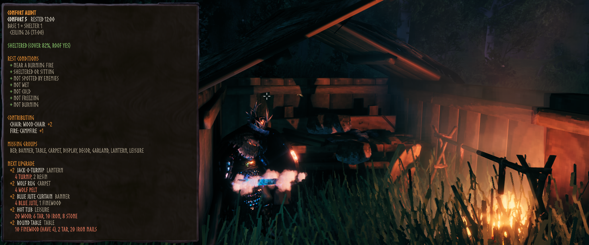
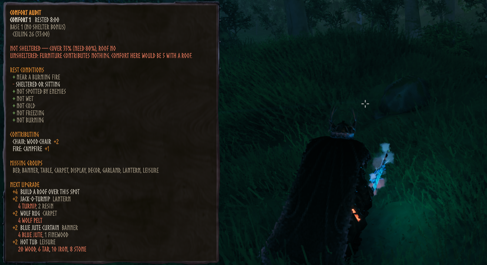
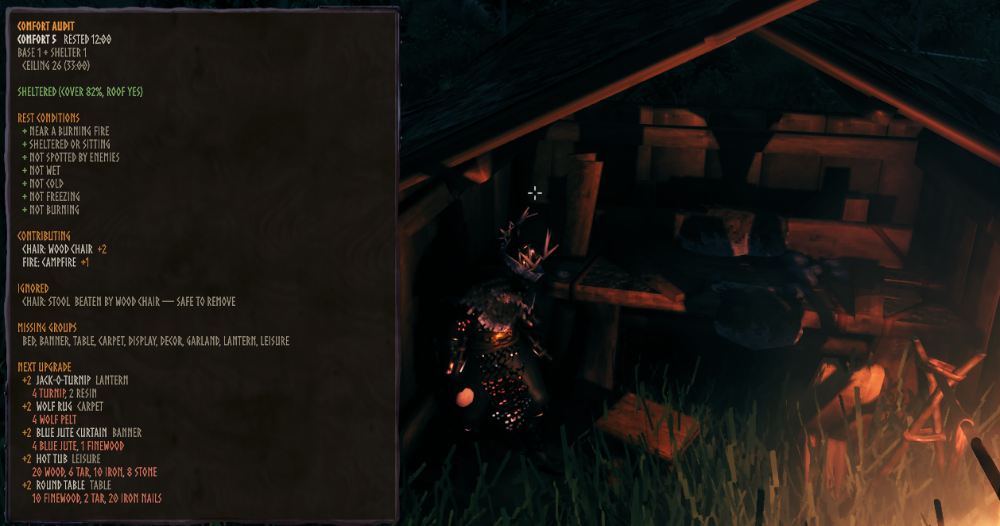
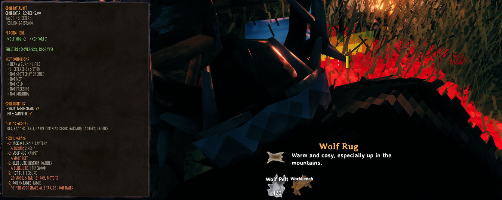

# Comfort Audit

A client-side Valheim mod that shows the arithmetic behind your Comfort level.

Valheim tells you a number and nothing else. Comfort Audit shows which furniture is actually
feeding it, which pieces are being silently ignored, what the cheapest next upgrade is, and — when
you are not getting Rested at all — which of the seven hidden conditions is failing.

Built and verified against **Valheim 1.0.12** (Deep North).

---

## Screenshots

**The panel.** What is in range, what each piece contributes, and the cheapest way up.



**Shelter is a gate, not a bonus.** Step outside and comfort collapses to 1 — the furniture stops
counting entirely, not partially. Building a roof here is worth +4.



**Pieces that are doing nothing.** The stool loses its group to the chair, so removing it costs you
nothing at all.



**Placement preview.** While building, what the held piece would add if placed where the ghost is.



## Install

[](https://thunderstore.io/c/valheim/p/Jumpingmushroom/ComfortAudit/)

Install through a mod manager (r2modman, Gale, Thunderstore Mod Manager) from the
[Thunderstore page](https://thunderstore.io/c/valheim/p/Jumpingmushroom/ComfortAudit/), or manually
by dropping `ComfortAudit.dll` into `BepInEx/plugins/`.

Requires BepInEx 5 and [Jotunn](https://thunderstore.io/c/valheim/p/ValheimModding/Jotunn/).

## What it does

Press **F7** for a panel covering:

- **Contributing** — each piece that won its comfort group, and what it added.
- **Ignored** — pieces beaten by a higher piece of the same group, or dropped by the game's
  duplicate-name rule. Safe to remove; you lose nothing.
- **Unlit** — fires and lanterns count zero while switched off, even though they are placed.
  Lighting one is a free gain.
- **Missing groups** — groups you have nothing for at all.
- **Rest conditions** — all seven, individually.
- **Ceiling** — the highest comfort reachable here with your current recipes, and with everything
  unlocked, each with the Rested duration it buys.
- **Next upgrade** — ranked by comfort gain, then weighted material cost, with a have/need check
  against your inventory.
- **Placement preview** — while building, what the held piece would add if placed where the ghost
  is, and what already beats it if the answer is nothing.

The Rested status icon also carries `10:00  3/11` — time remaining, current comfort, your ceiling —
readable at a glance without opening anything.

## Three things the game never tells you

**Shelter is not a bonus, it is a gate.** Unsheltered, comfort is a hard 1 and *no furniture counts
at all* — not reduced, zero. And because resting only requires *sitting or shelter*, you can doze at
a campfire under open sky with a fully furnished hall contributing nothing.

**Ungrouped pieces stack.** Most furniture is deduplicated to the best piece per group, but pieces
with no comfort group are only deduplicated by name, so several different ones all count. In vanilla
1.0.12 that is the two armour stands, the maypole and the yule tree, at +1 each.

**Rested duration is `8:00 + 1:00 per comfort level above 1`**, with no cap on comfort. The mod
reads those numbers from the game at runtime rather than assuming them.

## Compatibility

Client-side only. It reads local state and draws UI — no RPCs, no ZDO writes, no patches to any
networking class — so it is safe on vanilla servers and does not affect joining. Valheim's handshake
validates only the game version and network version; there is no mod check to trip.

It applies a **single** Harmony patch (`StatusEffect.GetIconText`, to add comfort to the Rested
label), and that one is disableable in config.

Pieces added by other mods are picked up automatically from the live prefab list. Comfort groups
outside the vanilla enum render as "Other" rather than crashing.

## Configuration

Through BepInEx config, editable in-game if you run a configuration manager:

| Setting | Default | |
|---|---|---|
| `ToggleKey` | F7 | Show/hide the panel |
| `ScanInterval` | 0.5 s | The game itself only recomputes comfort every 2 s |
| `Position` / `Width` | centred / 420 | `(0,0)` means "centre me"; the panel is also draggable |
| `ShowCeiling` | on | Reachable comfort, now and with everything unlocked |
| `ShowPlacementPreview` | on | Build-mode delta |
| `ShowComfortOnIcon` | on | Comfort on the Rested status icon |
| `Filter` | KnownAndStationInRange | KnownOnly / KnownAndStationInRange / Buildable |
| `MaxShown` | 5 | Number of suggestions |
| `ShowMaterials` | on | Material cost and have/need per suggestion |
| `ShowDistances`, `ShowPrefabNames` | off | Diagnostics for the piece list |

Material cost weights live in an editable table. Copy
`BepInEx/config/ComfortAudit.costs.json` to override the shipped defaults; anything absent scores
1.0, which reduces ranking to raw item count.

## Console

With `-console` enabled and `devcommands` active:

```
comfortaudit now      live breakdown here and now, also written to the log
comfortaudit pieces   every comfort piece prefab: group, comfort, cost
comfortaudit costs    material tokens in use, and which have no weight configured
comfortaudit groups   comfort groups and how many pieces each has
```

The same breakdown is written to the BepInEx log once per world, so it can be checked without the
console.

## Building

Requires the .NET SDK. Game assemblies are not redistributed — supply them yourself:

```bash
export VALHEIM_INSTALL=/path/to/steamapps/common/Valheim
dotnet build src/ComfortAudit/ComfortAudit.csproj -c Release
```

Without `VALHEIM_INSTALL` the build falls back to a local `lib/` directory (gitignored). Needed
there: `assembly_valheim`, `assembly_utils`, `assembly_guiutils`, the `UnityEngine.*` modules,
`Unity.TextMeshPro`, `Jotunn.dll`, `BepInEx.dll` and `0Harmony.dll`.

`assembly_valheim` is publicized at build time via `BepInEx.AssemblyPublicizer.MSBuild`; the shipped
DLL binds to the real members and runs against an unmodified install, and no publicized derivative
is ever committed.

Helper scripts:

```bash
./build/deploy.sh     # build and copy to a local or remote BepInEx profile
./build/package.sh    # validate and assemble the Thunderstore zip into dist/
./build/publish.sh    # publish that zip to Thunderstore via tcli
./build/logs.sh       # tail the remote BepInEx log
./build/shot.sh       # capture the Valheim window from the dev machine
./build/make_icon.py  # regenerate the Thunderstore icon
```

Publishing needs the Thunderstore CLI (`dotnet tool install -g tcli`) and a service account
token from your Thunderstore team settings:

```bash
TS_TEAM=<team> TCLI_AUTH_TOKEN=<token> ./build/publish.sh
./build/publish.sh --dry-run   # build and generate config without uploading
```

`thunderstore.toml` is generated from `thunderstore/manifest.json` at publish time and is
gitignored, so the manifest stays the single source of truth for version and dependencies.

## Licence

MIT. See [LICENSE](LICENSE).

Not affiliated with Iron Gate Studio. Valheim assemblies are the property of their authors and are
not distributed with this repository.
